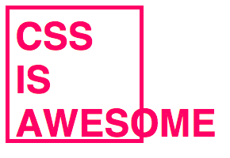

[index]: https://github.com/iagodahlem/cheatsheets
[robert-penner]: https://twitter.com/robpenner
[css-is-awesome]: https://jsbin.com/gasexu/edit?html,css,output
[centering-things-transform]: https://jsbin.com/gadidi/edit?html,css,output
[centering-things-table]: https://jsbin.com/medomec/edit?html,css,output
[centering-things-flexbox]: https://jsbin.com/bimeno/edit?html,css,output
[san-francisco-font]: https://developer.apple.com/fonts
[new-css-specs]: http://www.xanthir.com/b4Ko0
[custom-media-queries]: https://drafts.csswg.org/mediaqueries/#custom-mq
[media-queries]: https://github.com/rafaelrinaldi/media-queries
[custom-selectors]: http://dev.w3.org/csswg/css-extensions/#custom-selectors
[custom-properties]: https://www.w3.org/TR/css-variables
[list-selector]: https://jsbin.com/jegero/edit?html,css,output

# CSS

[][css-is-awesome]

1. [Apple San Fancisco font](#1.0)
2. [Centering things](#2.0)
	* [Using `transform` and absolute positioning](#2.1)
	* [Mimicking `<table>` display](#2.2)
	* [Using Flexbox](#2.3)
3. [Font anti alias](#3.0)
4. [New CSS specs](#4.0)
	* [Custom properties](#4.1) <small>(variables)</small>
	* [Custom media queries](#4.2)
	* [Custom selectors](#4.3)
5. [Single selector list styling](#5.0)
6. [Smooth scrolling](#6.0)
7. [Text selection](#7.0)
8. [Transition](#8.0)
9. [Animation](#9.0)
10. [Transition easing functions](#10.0)
11. [Scrollbar Webkit](#11.0)

---

### <a name='1.0'></a>[Apple San Francisco font][san-francisco-font]

```css
body {
	font-family: -apple-system, BlinkMacSystemFont, sans-serif;
}
```

### <a name='2.0'></a>Centering things

#### <a name='2.1'></a>[Using `transform` and absolute positioning][centering-things-transform]

Useful when you already know the container dimension

```css
.parent {
	position: relative;
	/* Arbitrary dimension */
	width: 150px;
	height: 150px;
}

.child {
	position: absolute;
	left: 50%;
	top: 50%;
	transform: translate(-50%, -50%);
}
```

#### <a name='2.2'></a>[Mimicking `<table>` display][centering-things-table]

```css
.parent {
	display: table;
}

.child {
	display: table-cell;
	vertical-align: middle;
	text-align: center;
}
```

#### <a name='2.3'></a>[Using Flexbox][centering-things-flexbox]

```css
.parent {
	display: flex;
	justify-content: center;
	align-items: center;
}

.child {}
```

### <a name='3.0'></a>Font anti alias

```css
* {
	text-rendering: optimizeLegibility;
	-webkit-font-smoothing: antialiased;
	-moz-osx-font-smoothing: grayscale;
}
```

### <a name='4.0'></a>[New CSS specs][new-css-specs]

#### <a name='4.1'></a>[Custom properties][custom-properties]

* `:root` for top-level properties
* `var()` to access values from custom properties

```css
:root {
	--color: #F06;
	--bg-color: #FFF;
}

body {
	color: var(--color);
	background-color: var(--bg-color);
}
```

#### <a name='4.2'></a>[Custom media queries][custom-media-queries]

```css
@custom-media --small-only screen and (max-width: 39.9375em);

@media (--small-only) {
	/* ... */
}
```

<small>For responsive breakpoints that support the future spec, check out [`media-queries`][media-queries].</small>

#### <a name='4.3'></a>[Custom selectors][custom-selectors]

```css
@custom-selector :--button button, a, input[type=button];

:--button {
	/* ... */
}
```

### <a name='5.0'></a>[Single selector list styling][list-selector]

```css
/* No need to use multiple selector nor override rules */

li:not(:last-of-type) {
	/* ... */
}
```

### <a name='6.0'></a>Smooth scrolling

```css
.container {
	-webkit-overflow-scrolling: touch;
	overflow-y: auto;
}
```

### <a name='7.0'></a>Text selection

```css
/* Can't select both at the same time */

::selection {
	color: #FFF;
	background-color: #F06;
}

::-moz-selection {
	color: #FFF;
	background-color: #F06;
}
```

### <a name='8.0'></a>Transition

```css
/* complete */
transition-property: propertie;
transition-duration: 0;
transition-timing-function: ease;
transition-delay: 0;

/* shortcode */
transition: |property| |duration| |timing-function| |delay|;
```

### <a name='9.0'></a>Animation

```css
/* complete */
animation-name: animationName;
animation-duration: 0 | 5s;
animation-timing-function: ease | cubic-bezier(/* matrix */);
animation-delay: 0;
animation-iteration-count: 1 | 2 | ... |infinite;
animation-direction: alternate | reverse;
animation-play-state: running | paused;

/* shortcode */
animation: |name| |duration| |timing-function| |delay| |iteration-count| |direction| |play-state|;

/* keyframe simple definition */
@keyframe animationName {
	from {  }
	to {  }
}

/* keyframe step by step definition */
@keyframe animationName {
	0% {  }
	50% {  }
}
```

### <a name='10.0'></a>Transition easing functions

Rounded values from [Robert Penner][robert-penner]'s easing functions.

```css
transition-timing-function: cubic-bezier(/* matrix */);
```

| Name | Matrix |
| --- | --- |
| Linear | `0.250, 0.250, 0.750, 0.750` |
| Ease | `0.250, 0.100, 0.250, 1.000` |
| Easein | `0.420, 0.000, 1.000, 1.000` |
| Easeout | `0.000, 0.000, 0.580, 1.000` |
| EaseInOut | `0.420, 0.000, 0.580, 1.000` |
| EaseInQuad |`0.550, 0.085, 0.680, 0.530` |
| EaseOutQuad | `0.250, 0.460, 0.450, 0.940` |
| EaseInOutQuad | `0.455, 0.030, 0.515, 0.955` |
| EaseInCubic | `0.550, 0.055, 0.675, 0.190` |
| EaseOutCubic | `0.215, 0.610, 0.355, 1.000` |
| EaseInOutCubic | `0.645, 0.045, 0.355, 1.000` |
| EaseInQuart | `0.895, 0.030, 0.685, 0.220` |
| EaseOutQuart | `0.165, 0.840, 0.440, 1.000` |
| EaseInOutQuart | `0.770, 0.000, 0.175, 1.000` |
| EaseInQuint | `0.755, 0.050, 0.855, 0.060` |
| EaseOutQuint | `0.230, 1.000, 0.320, 1.000` |
| EaseInOutQuint | `0.860, 0.000, 0.070, 1.000` |
| EaseInSine | `0.470, 0.000, 0.745, 0.715` |
| EaseOutSine | `0.390, 0.575, 0.565, 1.000` |
| EaseInOutSine | `0.445, 0.050, 0.550, 0.950` |
| EaseInExpo | `0.950, 0.050, 0.795, 0.035` |
| EaseOutExpo | `0.190, 1.000, 0.220, 1.000` |
| EaseInOutExpo | `1.000, 0.000, 0.000, 1.000` |
| EaseInCirc | `0.600, 0.040, 0.980, 0.335` |
| EaseOutCirc | `0.075, 0.820, 0.165, 1.000` |
| EaseInOutCirc | `0.785, 0.135, 0.150, 0.860` |
| EaseInBack | `0.600, -0.280, 0.735, 0.045` |
| EaseOutBack | `0.175, 0.885, 0.320, 1.275` |
| EaseInOutBack | `0.680, -0.550, 0.265, 1.550` |

### <a name='11.0'></a>Scrollbar Webkit

#### Pieces

```css
::-webkit-scrollbar
::-webkit-scrollbar-button
::-webkit-scrollbar-track
::-webkit-scrollbar-track-piece
::-webkit-scrollbar-thumb
::-webkit-scrollbar-corner
::-webkit-resizer
```

#### States

```css
:horizontal
:vertical
:decrement
:increment
:start
:end
:double-button
:single-button
:no-button
:corner-present
:window-inactive
```

---

[← Back][index]
